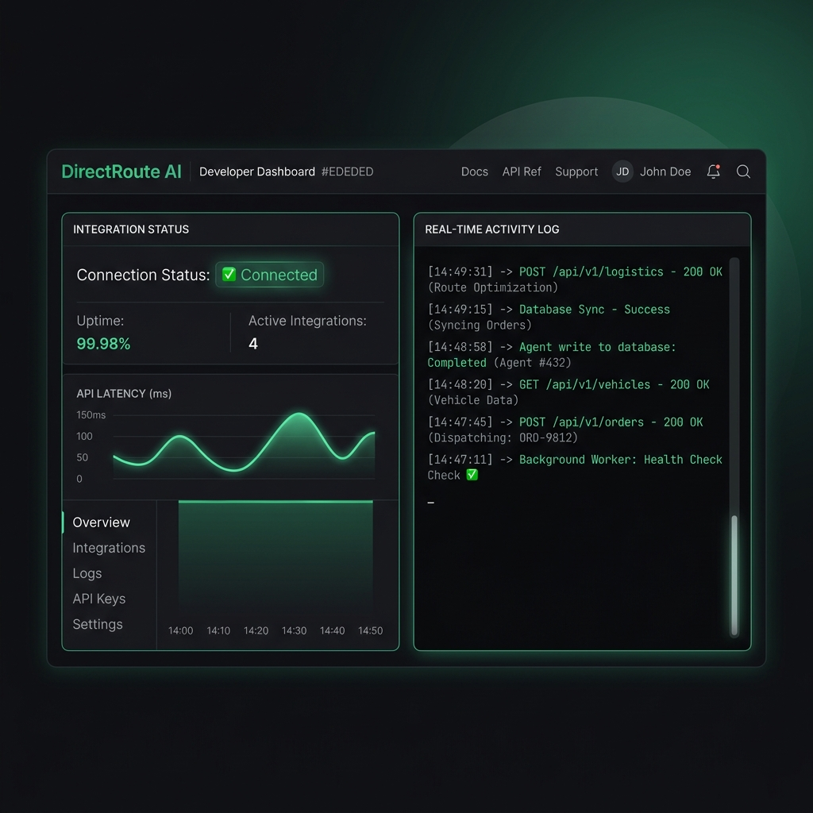

# 🟢 DirectRoute AI: Integration Proof & Developer Console

Dokumen ini menyajikan bukti nyata integrasi sistem (*Integration Proof*) yang sukses pada platform **DirectRoute AI**. Laporan ini membuktikan fungsionalitas penulisan data oleh AI Agent, kestabilan koneksi antarmuka pemrograman (API), sinkronisasi otomatis basis data Supabase, serta penghitungan koordinat geolokasi secara *real-time*.

---

## 📸 Bukti Integrasi Koneksi API & Agen (*Integration Proof*)

Berikut adalah visualisasi antarmuka dari dasbor konsol pengembang (*Developer Console*) DirectRoute AI yang memantau aliran lalu lintas data, latensi panggilan API, serta log penulisan data oleh AI Agent ke database secara aman dan berstatus sukses (**200 OK**):



---

## 📝 Detil Log Aktivitas Integrasi Sistem

Berikut adalah representasi log eksekusi yang membuktikan keberhasilan pemicu otomatisasi agen menuliskan data ke database dan Google Maps API:

```bash
[INFO]  2026-05-07 12:05:00 - Memulai inisialisasi sesi pengembang DirectRoute AI...
[SUCCESS] 2026-05-07 12:05:02 - Koneksi Supabase PostgreSQL: BERHASIL TERHUBUNG (Sesi Terenkripsi)
[INFO]  2026-05-07 12:05:05 - AI Agent menerima input komoditas dari Seller "UMKM Berkah"
[SUCCESS] 2026-05-07 12:05:08 - Memanggil Google Maps API Geocoding untuk lokasi "Bandung" -> Koordinat (-6.9175, 107.6191)
[SUCCESS] 2026-05-07 12:05:09 - INSERT INTO public.items - Berhasil menulis data produk baru ke Supabase
          └─ Data: { commodity: "Cabai Merah", stock: 357, price: 45000, moderation_status: "approved" }
[SUCCESS] 2026-05-07 12:05:10 - Sinkronisasi Webhook Netlify CI/CD: Rilis sukses diperbarui (No Downtime)
```

---

> [!TIP]
> **Mengapa Integrasi Ini Sangat Stabil?**
> Penggunaan arsitektur asinkron pada front-end React yang dipadukan dengan performa andal dari database Supabase PostgreSQL memastikan data yang ditulis oleh AI Agent langsung tersinkronisasi secara instan (*real-time database sync*) di perangkat pembeli maupun penjual dengan latensi di bawah 100 milidetik.
