# 📊 Dokumentasi Sequence Diagram - DirectRoute AI

Dokumen ini berisi kumpulan **Sequence Diagram** tingkat tinggi yang disesuaikan secara presisi dengan arsitektur sistem, database, dan fitur aktual yang berjalan pada platform **DirectRoute AI**.

---

## 1. Sequence: Registrasi & Login (Supabase Auth & Profile Sync)

Diagram ini menggambarkan alur pendaftaran dan masuk pengguna menggunakan **Supabase Auth** dan sinkronisasi otomatis dengan tabel `profiles` PostgreSQL.

```mermaid
sequenceDiagram
    autonumber

    actor User as 👤 Pengguna (Petani / Buyer)
    participant UI as 💻 Frontend (Vite.js React)
    participant Auth as 🔐 Supabase Auth Service
    participant DB as 🗄️ PostgreSQL (profiles Table)

    rect rgb(15, 23, 42)
        Note over User, DB: ALUR REGISTRASI AKUN BARU

        User->>UI: Mengisi Form Registrasi (Username, Email, Password, Role)
        UI->>Auth: supabase.auth.signUp({ email, password })
        
        alt Registrasi Sukses
            Auth-->>UI: Return Auth Session (User ID)
            UI->>DB: INSERT INTO profiles (id, username, role, balance)
            DB-->>UI: Profil Berhasil Dibuat (RLS Validated)
            UI-->>User: Registrasi Sukses & Redirect ke Dashboard sesuai Role
        else Registrasi Gagal (Email Duplikat / Password Lemah)
            Auth-->>UI: Return Error Message
            UI-->>User: Tampilkan Pesan Error di Toast Notification
        end
    end

    rect rgb(30, 41, 59)
        Note over User, DB: ALUR LOGIN AKUN

        User->>UI: Mengisi Form Login (Email, Password)
        UI->>Auth: supabase.auth.signInWithPassword({ email, password })
        
        alt Kredensial Valid
            Auth-->>UI: Return Session & JWT Token
            UI->>DB: SELECT role, username FROM profiles WHERE id = user_id
            DB-->>UI: Return Data Profil
            UI-->>User: Login Berhasil & Redirect ke Dashboard / Marketplace
        else Kredensial Salah
            Auth-->>UI: Return AuthError
            UI-->>User: Tampilkan "Kredensial Tidak Valid"
        end
    end
```

---

## 2. Sequence: Seller Input Produk & Auto-Image / Geocoding Discovery

Petani menginput komoditas panen ke kebun/gudang dengan fitur canggih **Auto-Image (Serper + Unsplash API)** serta pencarian koordinat kebun otomatis (**Nominatim Geocoding API**).

```mermaid
sequenceDiagram
    autonumber

    actor Seller as 👨‍🌾 Petani / Seller
    participant UI as 💻 Dashboard Petani
    participant Geo as 🗺️ Nominatim Geocoding API
    participant Serper as 🔍 Serper / Unsplash API
    participant DB as 🗄️ PostgreSQL (products Table)

    rect rgb(2, 44, 34)
        Note over Seller, DB: GEOCODING & AUTO-IMAGE SEARCH

        Seller->>UI: Input Lokasi Kebun (contoh: "Lembang, Bandung")
        UI->>Geo: GET /search?q=Lembang&format=json
        Geo-->>UI: Return Lat/Lng Coordinates (-6.81, 107.61)
        UI-->>Seller: Tampilkan Pin Koordinat di Leaflet Maps UI

        Seller->>UI: Masukkan Komoditas & Klik "Isi Gambar Otomatis"
        UI->>Serper: GET /search?q={commodity}&engine=images (Fallback: Unsplash)
        Serper-->>UI: Return Link URL Gambar Komoditas Berkualitas Tinggi
        UI-->>Seller: Tampilkan Preview Gambar Komoditas di Form

        Seller->>UI: Klik "Terbitkan Produk ke Marketplace"
        UI->>DB: INSERT INTO products (umkm_name, commodity, stock, price, location, image_url)
        DB-->>UI: Status 201 Created (RLS Authenticated)
        UI-->>Seller: Tampilkan Alert "Produk Berhasil Diterbitkan!"
    end
```

---

## 3. Sequence: Buyer Menjelajahi Katalog & Checkout Pesanan

Sistem pemesanan oleh Buyer (Restoran/Hotel) yang langsung mengurangi ketersediaan stok produk petani di database secara aman.

```mermaid
sequenceDiagram
    autonumber

    actor Buyer as 🏨 Restoran / Buyer
    participant UI as 💻 Buyer Marketplace
    participant DB as 🗄️ PostgreSQL (products & orders Tables)

    rect rgb(2, 44, 34)
        Note over Buyer, DB: SELEKSI & CHECKOUT ORDER

        Buyer->>UI: Membuka Halaman Katalog Panen
        UI->>DB: SELECT * FROM products WHERE stock > 0
        DB-->>UI: Return Daftar Komoditas Panen Aktif
        UI-->>Buyer: Render Grid Produk Kreatif (Kartu Interaktif)

        Buyer->>UI: Masukkan Jumlah Beli (kg) & Klik "Beli Sekarang"
        UI->>DB: Cek kecukupan stok di tabel `products`
        
        alt Stok Mencukupi
            DB-->>UI: Stok Tersedia
            UI->>DB: INSERT INTO orders (buyer_name, commodity, quantity, status, buyer_location)
            UI->>DB: UPDATE products SET stock = stock - quantity WHERE id = product_id
            DB-->>UI: Transaksi Berhasil Disimpan
            UI-->>Buyer: Tampilkan Ringkasan Pembelian & Masuk ke Status Pending
        else Stok Kurang
            DB-->>UI: Stok Tidak Cukup
            UI-->>Buyer: Tampilkan Notifikasi "Stok tidak mencukupi batas pesanan Anda!"
        end
    end
```

---

## 4. Sequence: Real-time Price Discovery & Strategist AI

Alur kerja cerdas langkah ke-0 dan ke-1 untuk memvalidasi harga komoditas terhadap data resmi **PIHPS Bank Indonesia** atau scraping data **BPS Nasional** via Serper.

```mermaid
sequenceDiagram
    autonumber

    actor Seller as 👨‍🌾 Petani / Seller
    participant UI as 💻 Dashboard Petani
    participant Proxy as 🖥️ Backend Server
    participant BI as 🏛️ PIHPS (Bank Indonesia) API
    participant Serper as 🌐 Serper BPS/Kemendag Search
    participant LLM as 🤖 Ollama / OpenAI LLM
    participant DB as 🗄️ PostgreSQL

    rect rgb(30, 27, 75)
        Note over Seller, DB: STEP 0 & STEP 1: MARKET PRICE DISCOVERY

        Seller->>UI: Klik "Run Agentic Workflow"
        UI->>Proxy: GET /api/market/pihps?q={commodity}
        
        alt Data PIHPS Tersedia
            Proxy->>BI: Fetch Harga Acuan Harian BI
            BI-->>Proxy: Return Harga Komoditas Strategis (Rp/kg)
        else Fallback ke Serper BPS
            Proxy->>Serper: Search "Harga eceran BPS Bappenas {commodity}"
            Serper-->>Proxy: Return Artikel & Data Statistik Terkait
        end
        
        Proxy-->>UI: Kirim Data Pasar Terbaru (Trusted Price & Sources)

        UI->>LLM: Kirim Prompt (PRICE_STRATEGIST) + Data Referensi Pasar + Detail Produk Anda
        LLM->>LLM: Analisis Margin Adil, Deteksi Potensi Tengkulak, & Rumuskan Strategi
        LLM-->>UI: Return JSON (Rekomendasi Harga, Estimasi Harga Tengkulak, Rasionalisasi)
        
        UI-->>Seller: Tampilkan Kartu "Price Strategist AI" (Rekomendasi & Analisis Profit)
    end
```

---

## 5. Sequence: Dedicated Logistics Route Orchestrator Agent (TSP Solver)

Alur khusus pencarian rute pada tab **Logistics** yang menjalankan **Traveling Salesperson Problem (TSP) Solver** terintegrasi, menganalisis permutasi rute untuk hingga 10 destinasi guna menemukan rute terpendek.

```mermaid
sequenceDiagram
    autonumber

    actor Seller as 👨‍🌾 Petani / Seller
    participant UI as 💻 Tab Logistics (Dashboard)
    participant LLM as 🤖 Ollama / OpenAI LLM
    participant DB as 🗄️ PostgreSQL (orders Table)

    rect rgb(30, 27, 75)
        Note over Seller, DB: DEDICATED LOGISTICS ROUTING (TSP Permutations)

        Seller->>UI: Memilih hingga 10 Pesanan Buyer & Klik "Dapatkan Rekomendasi Rute"
        UI->>DB: SELECT * FROM orders WHERE id IN (selected_ids)
        DB-->>UI: Return Lokasi Koordinat & Detail Kargo Masing-masing Buyer
        
        UI->>UI: Eksekusi `getCandidateRoutes()` (Hingga 10 Destinasi)
        Note over UI: 1. Hitung rute original & terbalik<br/>2. Jalankan Heuristik Greedy Nearest-Neighbor TSP<br/>3. Generate 100+ permutasi acak (Fisher-Yates)

        UI->>LLM: Kirim data muatan & koordinat buyer (ROUTE_ORCHESTRATOR Prompt)
        LLM->>LLM: Analisis urutan pengiriman & kendala kargo 500kg
        LLM-->>UI: Return Rekomendasi Urutan Pengiriman Utama (JSON)

        UI->>UI: Kalkulasi Total Jarak (Haversine Formula) & Durasi Rute untuk semua kombinasi
        UI->>UI: Sorting Rute dari Jarak Terpendek (Optimal) ke Terpanjang

        UI->>UI: Tambahkan Log Terperinci ke Panel Terminal Visual (TerminalLogger)
        UI-->>Seller: Render Pilihan Rute 1 s/d 5 (Jarak Terpendek) pada Kartu Rute
    end
```

---

## 6. Sequence: Shipping Cost Breakdown & Pro-rata Allocation

Sistem perhitungan ongkir multi-drop berdasarkan jenis armada serta alokasi biaya pengiriman secara proporsional (*pro-rata*) berdasarkan berat muatan per buyer.

```mermaid
sequenceDiagram
    autonumber

    actor Seller as 👨‍🌾 Petani / Seller
    participant UI as 💻 Tab Logistics
    participant Maps as 🗺️ Google Maps API
    participant DB as 🗄️ PostgreSQL (orders & shipments Tables)

    rect rgb(15, 23, 42)
        Note over Seller, DB: ESTIMASI & ALOKASI BIAYA PENGIRIMAN

        Seller->>UI: Memilih Rute & Jenis Kendaraan (Motor / Pickup / Truk)
        UI->>Maps: GET /directions (Asal, Waypoints, Tujuan)
        Maps-->>UI: Return Akurat Jarak (km), Durasi (menit), & Polylines Rute
        
        UI->>UI: Hitung Estimasi Ongkir (Biaya Dasar + Jarak + Durasi + Premi Muatan)
        UI->>UI: Alokasi Biaya Pengiriman ke setiap Buyer secara Pro-Rata (kg/Total kg)

        Seller->>UI: Klik "Konfirmasi Pengiriman Rute"
        
        par Simpan Logistik Global
            UI->>DB: INSERT INTO shipments (route_data, vehicle_type, shipping_cost_total, route_distance_km)
        and Perbarui Setiap Pesanan Buyer
            UI->>DB: UPDATE orders SET status = 'shipped', shipping_cost_total = pro_rata_share WHERE id = buyer_order_id
        end
        
        DB-->>UI: Logistik & Status Transaksi Berhasil Disimpan
        UI-->>Seller: Render Rute di Google Maps & Kurangi Stok Gudang Fisik
    end
```

---

## 7. Sequence: Tracking & Proof of Delivery (POD) Canvas

Alur pelacakan barang oleh Buyer serta proses serah terima barang menggunakan tanda tangan digital langsung di layar HP/Tablet (HTML5 Canvas Signature) dan upload foto bukti barang diterima.

```mermaid
sequenceDiagram
    autonumber

    actor Buyer as 🏨 Penerima / Buyer
    actor Driver as 🚚 Driver / Seller
    participant UI as 💻 Portal Pengiriman
    participant DB as 🗄️ PostgreSQL (orders Table)

    rect rgb(23, 23, 23)
        Note over Buyer, DB: TRACKING & PROOF OF DELIVERY (POD)

        Buyer->>UI: Cek Status Pesanan (Tracking ID)
        UI->>DB: SELECT status, shipping_cost_total FROM orders WHERE id = order_id
        DB-->>UI: Return Status "shipped"
        UI-->>Buyer: Tampilkan "Pesanan Sedang Dikirim ke Lokasi Anda"

        Driver->>UI: Sampai di Lokasi Buyer & Buka Panel "Konfirmasi Diterima"
        UI-->>Driver: Tampilkan Canvas Tanda Tangan & Input Nama Penerima

        Buyer->>UI: Menuliskan Tanda Tangan Digital pada Canvas & Mengambil Foto POD
        UI->>UI: Konversi Canvas Tanda Tangan ke format Base64 / URL Gambar
        
        Driver->>UI: Klik "Selesaikan Pengiriman"
        UI->>DB: UPDATE orders SET status = 'delivered', receiver_name = name, pod_photo_url = photo, pod_signature_url = signature
        DB-->>UI: Update Sukses
        UI-->>Driver: Pengiriman Berhasil Diselesaikan (Status Selesai)
        UI-->>Buyer: Status Berubah menjadi "Diterima"
    end
```

---

## 8. Sequence: WhatsApp Dynamic Outreach AI

Langkah terakhir (Step 3) dari alur cerdas yang menyaring pesan dengan modul deteksi penipuan (*anti-fraud clearance*) dan mengarahkan petani ke aplikasi WhatsApp menggunakan *Deep Linking*.

```mermaid
sequenceDiagram
    autonumber

    actor Seller as 👨‍🌾 Petani / Seller
    actor Buyer as 🏨 Restoran / Buyer
    participant UI as 💻 Dashboard Petani
    participant LLM as 🤖 Ollama / OpenAI LLM
    participant WA as 💬 WhatsApp Web/App Link

    rect rgb(30, 27, 75)
        Note over Seller, WA: STEP 3: ANTI-FRAUD CLEARANCE & WHATSAPP DEEP LINK

        Seller->>UI: Klik "Generate WhatsApp Draft"
        UI->>LLM: Kirim detail produk panen & estimasi harga (OUTREACH_SECURITY Prompt)
        
        LLM->>LLM: 1. Tulis pesan persuasif formal Bahasa Indonesia<br/>2. Jalankan Filter Keamanan (Bebas indikasi penipuan/spam)<br/>3. Sisipkan Tips Micro-learning terkait penanganan kargo
        LLM-->>UI: Return JSON Draft Pesan Aman

        UI-->>Seller: Tampilkan Preview Pesan WhatsApp di UI Outreach Card
        
        Seller->>UI: Klik "Kirim Pesan WhatsApp"
        UI->>WA: Buka Deep Link (wa.me/{phone_number}?text={encoded_draft})
        WA-->>Buyer: Pesan Masuk secara Personal dari Petani
    end
```

